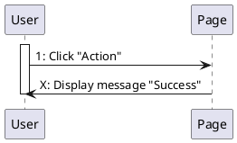
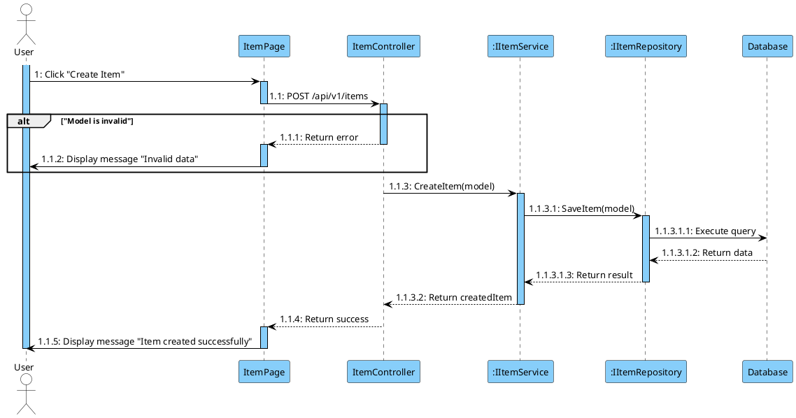

### **Instruction Prompt**

You are an expert software architect.
**Your task:** Create or update a file named **`[FunctionName].puml`** containing a PlantUML sequence diagram that visualizes the execution flow of the **[INSERT FUNCTION NAME HERE]** feature.

---

# 🔹 **GLOBAL RULES**

### **1. Step Numbers Are IMMUTABLE**

- Existing `.puml` files **must keep every step number exactly the same**.
  You are **not allowed** to:

  - renumber
  - reorder
  - merge
  - split
  - insert numbers inside an existing chain

- When creating a new file, start at `1:` and follow hierarchical numbering:
  `1 → 1.1 → 1.1.1 → 1.1.1.1`

### **2. Participant Order (Mandatory)**

Declare participants in this exact order:

**Actor → Frontend Page → Controller → Service(s) → Repository(s) → Database**

### **3. Naming Convention**

- **Frontend Page inference:**

  - Take the Controller name
  - Remove `"Controller"`
  - Add `"Page"`
  - Example: `ItemController` → `ItemPage`

- Do **NOT** use generic names like `"FrontendPage"`.
- Backend classes must use interface notation:
  `:IItemService`, `:IItemRepository`, etc.
- **Never** use square brackets `[]` in participant names.

### **4. Return Arrow Rules**

- Do _not_ generate dashed return arrows for void or trivial cases.
- **Exception:** Repository → Database interactions **must always** show:

  - `"Execute query"`
  - `"Return data"` or `"Return null"`

### **5. Grammar Rules**

Use correct English:

- `"User does not exist"`
- Not: `"User is not existed"`

---

# 🔹 **ACTIVATION & DEACTIVATION RULES (ALL LAYERS)**

### **6. General Activation Principle**

**Every participant activates when receiving a call and deactivates after returning a response.**

**Special cases:**

- **User** - Activated from the very beginning and remains active until the end
- **Database** - Activates when receiving a query and deactivates after returning data

### **7. CRITICAL: Activation State Management**

**IMPORTANT RULES:**

1. **Never deactivate a participant while they are still processing or waiting for responses**
2. **A participant can only be deactivated AFTER they have returned their final response to their caller**
3. **When re-entering an already active participant (like Controller calling Service multiple times), do NOT add another `activate` - they are already active**
4. **Only add `activate` when the participant is currently inactive (deactivated earlier or never activated)**

### **8. Layer-Specific Rules**

#### **User (Always Active)**

**Activate:** At the very start of the diagram (before any interaction)

**Deactivate:** At the very end of the diagram (after receiving final message)



#### **Frontend Page (User ↔ Page)**

**Activate when:**

- User sends action to Page

**Deactivate when:**

- Page sends request to Controller (waiting for backend)

**Re-activate when:**

- Page receives response from Controller

**Final deactivate when:**

- Page displays message to User

```plantuml
User -> Page: 1: Click "Action"
activate Page
Page -> Controller: 1.1: POST /api/v1/items
deactivate Page
' ... backend processing ...
Controller --> Page: 1.1.5: Return success
activate Page
Page -> User: 1.1.6: Display message "Success"
deactivate Page
```

#### **Controller (Page ↔ Controller ↔ Service)**

**Activate when:**

- Page calls Controller (first time only)

**Stay active during:**

- All validations
- All Service calls
- Any error handling within Controller
- Any alt/loop blocks inside Controller processing

**Deactivate when:**

- Controller returns final response to Page

**CRITICAL:** Controller activates ONCE when called by Page and stays active until it returns to Page. Do NOT deactivate Controller inside alt blocks unless that alt block contains the final return to Page.

```plantuml
Page -> Controller: 1.1: POST /api/v1/items
activate Controller

alt "User not found"
    Controller --> Page: 1.1.1: Return error
    deactivate Controller
    ' Controller is now deactivated because it returned to Page
end

' If not in error branch, Controller is STILL ACTIVE
Controller -> Service: 1.1.2: CreateItem(model)
' ... more processing ...
Controller --> Page: 1.1.5: Return success
deactivate Controller
```

#### **Service (Controller ↔ Service ↔ Repository)**

**Activate when:**

- Controller calls Service (first time only)

**Stay active during:**

- All business logic
- All Repository calls
- Any validation or processing within Service

**Deactivate when:**

- Service returns final response to Controller

**CRITICAL:** Service activates ONCE when called by Controller and stays active throughout all Repository calls. Do NOT deactivate Service between Repository calls.

```plantuml
Controller -> Service: 1.1.3: CreateItem(model)
activate Service

Service -> Repo: 1.1.3.1: GetUserById(userId)
activate Repo
' Repo does its work...
Repo --> Service: 1.1.3.1.3: Return user
deactivate Repo

' Service is STILL ACTIVE
Service -> Repo: 1.1.3.2: SaveItem(item)
activate Repo
' Repo does its work...
Repo --> Service: 1.1.3.2.3: Return savedItem
deactivate Repo

Service --> Controller: 1.1.3.3: Return createdItem
deactivate Service
```

#### **Repository (Service ↔ Repository ↔ Database)**

**Activate when:**

- Service calls Repository

**Deactivate when:**

- Repository returns to Service (after DB interaction)

```plantuml
Service -> Repo: 1.1.3.1: SaveItem(model)
activate Repo
Repo -> DB: 1.1.3.1.1: Execute query
activate DB
DB --> Repo: 1.1.3.1.2: Return data
deactivate DB
Repo --> Service: 1.1.3.1.3: Return result
deactivate Repo
```

#### **Database (Repository ↔ Database)**

**Activate when:**

- Repository sends query to Database

**Deactivate when:**

- Database returns data to Repository

```plantuml
Repo -> DB: X: Execute query
activate DB
DB --> Repo: X.1: Return data
deactivate DB
```

### **10. Final UI Output**

The diagram must end with:

```text
Page -> User: X: Display message "Actual message"
deactivate Page
```

---

# 🔹 **CONDITIONAL LOGIC RULES (EXTREMELY IMPORTANT)**

### **8. Clean, Human-Readable Conditions**

Use short English statements:

- `"User not found"`
- `"Invalid model"`
- `"Relationship does not exist"`

Do **NOT** use raw code expressions in the condition text.

### **9. alt Block Rules**

- Use `alt` **only when there is actual branching**.

- If the validation only has 1 error path:
  **Do NOT use an else.**

  ```plantuml
  alt "User not found"
      ' Error logic
  end
  ' Happy path continues here
  ```

- Only use `[else]` when two branches belong to the _same_ decision.

### **10. Keep Logic Flat**

Avoid deep nesting. Use multiple sequential `alt` blocks instead of one massive nested block unless required.

### **11. Minimal Error Branches**

Inside validation branches:

- Keep logic minimal
- Only include:

  - controller → page return
  - UI message

- Do NOT generate redundant:

  - "return success"
  - unnecessary deactivation steps
  - repeated response chains

---

# 🔹 **DATABASE RULES**

### **12. Repository → DB Interaction**

Always show:

```plantuml
Repo -> DB: X: Execute query
DB --> Repo: X: Return data
```

Never skip database returns.

---

# 🔹 **GENERATED OUTPUT REQUIREMENTS**

### **13. Output a complete, valid `.puml`**

Using the structure below (names change per function):



---

# 🔹 **ACTIVATION/DEACTIVATION SUMMARY**

**General Rule:** Every participant (except User) activates when receiving a call and deactivates after returning.

| **Layer**      | **Activates When**                | **Stays Active During**                            | **Deactivates When**                |
| -------------- | --------------------------------- | -------------------------------------------------- | ----------------------------------- |
| **User**       | ⭐ At diagram start               | Entire flow                                        | ⭐ At diagram end                   |
| **Page**       | User → Page                       | Request preparation                                | Page → Controller                   |
| **Page**       | Controller → Page (re-activation) | Response processing                                | Page → User                         |
| **Controller** | Page → Controller                 | All validations, all Service calls, error handling | Controller → Page (final return)    |
| **Service**    | Controller → Service              | All business logic, all Repo calls                 | Service → Controller (final return) |
| **Repository** | Service → Repository              | DB query execution                                 | Repository → Service                |
| **Database**   | Repository → Database             | Query execution                                    | Database → Repository               |

**KEY INSIGHTS:**

1. **User**: Always active (start to end)
2. **Page**: Activates twice - once for sending request, once for receiving response
3. **Controller**: Activates ONCE per request, stays active through all processing, deactivates only when returning to Page
4. **Service**: Activates ONCE per Controller call, stays active through all Repository calls
5. **Repository**: Activates/deactivates per call (each Repository method call is independent)
6. **Database**: Activates/deactivates per query

**CRITICAL ERROR TO AVOID:**
❌ **DO NOT deactivate Controller/Service in the middle of processing unless returning to caller**
✅ **Controller/Service stay active until they complete ALL their work and return**

**Page Lifecycle Example:**

```
1. User → Page [ACTIVATE Page]
2. Page → Controller [DEACTIVATE Page]
3. ... backend processing (Page is inactive) ...
4. Controller → Page [RE-ACTIVATE Page]
5. Page → User [DEACTIVATE Page]
```

**Controller/Service Pattern:**

```
1. Page → Controller [ACTIVATE Controller]
2. Controller → Service [ACTIVATE Service]
3. Service → Repo [ACTIVATE Repo]
4. Repo → DB [ACTIVATE DB]
5. DB → Repo [DEACTIVATE DB]
6. Repo → Service [DEACTIVATE Repo]
   ' Service is STILL ACTIVE
7. Service → Repo (2nd call) [ACTIVATE Repo again]
8. Repo → DB [ACTIVATE DB]
9. DB → Repo [DEACTIVATE DB]
10. Repo → Service [DEACTIVATE Repo]
11. Service → Controller [DEACTIVATE Service]
12. Controller → Page [DEACTIVATE Controller]
```

**Full Stack Example:**

```
[START] activate User
User → Page [activate Page]
Page → Controller [deactivate Page, activate Controller]
Controller → Service [activate Service]
  Service → Repo #1 [activate Repo]
    Repo → DB [activate DB]
    DB → Repo [deactivate DB]
  Repo → Service [deactivate Repo]
  ' Service STILL ACTIVE
  Service → Repo #2 [activate Repo]
    Repo → DB [activate DB]
    DB → Repo [deactivate DB]
  Repo → Service [deactivate Repo]
Service → Controller [deactivate Service]
Controller → Page [deactivate Controller, activate Page]
Page → User [deactivate Page]
[END] deactivate User
```
