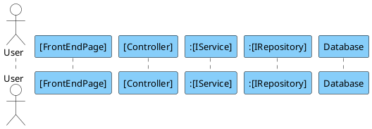

You are an expert software architect. I need a PlantUML Sequence Diagram that visualizes the execution flow of the [INSERT FUNCTION NAME HERE] feature.

**REFERENCE STYLE & FORMATTING RULES**
You must strictly follow the styling and logic depth of the provided reference standard:

1.  **Strict Hierarchical Numbering:** Every message must be numbered based on depth (e.g., 1 -> 1.1 -> 1.1.1 -> 1.1.1.1).
2.  **Participant Order:** Actor -> Frontend Page -> Controller -> Service(s) -> Repository(s) -> Database.
3.  **Naming Convention:** Use Interface names for backend components where applicable (e.g., `:IItemService`).
4.  **Visual Style:** Use the skinparams provided below (Blue lifelines, white backgrounds).

**MANDATORY TEXT PATTERNS**
You must use these EXACT phrases for specific actions:

1.  **Database Interaction:** Any call from a Repository to the Database must be labeled: **"Execute query"**.
2.  **UI Feedback:** When the code returns a string or error to the frontend that is shown to the user, you must label the final step as: **"Display message 'ACTUAL STRING FROM CODE'"**.

**PARTICIPANTS**
Map the code to these specific participant types:

- **Actor:** The User.
- **Frontend:** The specific Page/Component (e.g., `BulkUploadPage`).
- **Controller:** The Backend API Controller.
- **Service:** The Domain Service layer (prefix with `:`).
- **Repositories:** All distinct repositories (prefix with `:`).
- **Database:** A single participant named "Database" at the far right.

**LOGIC & FLOW REQUIREMENTS**

1.  **Entry Point:** Start with User -> Page (Access/POST).
2.  **Service Logic:**
    - **Loops:** Use `loop` blocks for iterations (e.g., `[For each item]`).
    - **Validations:** Use `alt` / `else` blocks for logical branches (e.g., `[category == null]`).
3.  **Return Path:**
    - Use dashed arrows (`-->`) for returns.
    - Ensure the final return to the user includes the "Display message" text as defined above.

**PLANTUML CODE**
Generate ONLY the PlantUML code inside `@startuml` and `@enduml`.

