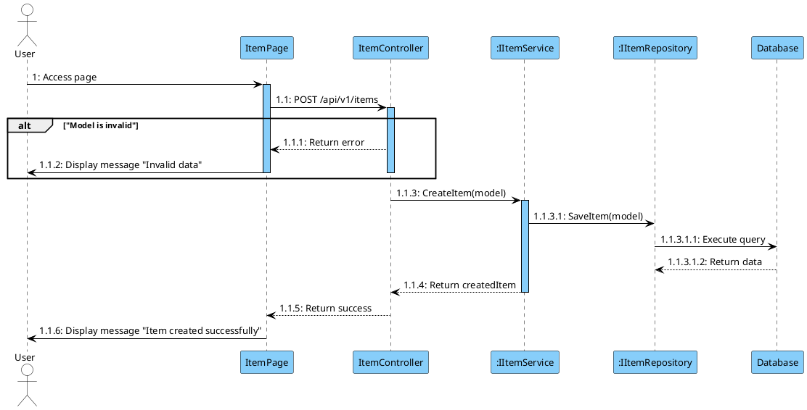

### **Instruction Prompt**

You are an expert software architect.
**Your task:** Create or update a file named **`[FunctionName].puml`** containing a PlantUML sequence diagram that visualizes the execution flow of the **[INSERT FUNCTION NAME HERE]** feature.

---

# 🔹 **GLOBAL RULES**

### **1. Step Numbers Are IMMUTABLE**

- Existing `.puml` files **must keep every step number exactly the same**.
  You are **not allowed** to:

  - renumber
  - reorder
  - merge
  - split
  - insert numbers inside an existing chain

- When creating a new file, start at `1:` and follow hierarchical numbering:
  `1 → 1.1 → 1.1.1 → 1.1.1.1`

### **2. Participant Order (Mandatory)**

Declare participants in this exact order:

**Actor → Frontend Page → Controller → Service(s) → Repository(s) → Database**

### **3. Naming Convention**

- **Frontend Page inference:**

  - Take the Controller name
  - Remove `"Controller"`
  - Add `"Page"`
  - Example: `ItemController` → `ItemPage`

- Do **NOT** use generic names like `"FrontendPage"`.
- Backend classes must use interface notation:
  `:IItemService`, `:IItemRepository`, etc.
- **Never** use square brackets `[]` in participant names.

### **4. Return Arrow Rules**

- Do _not_ generate dashed return arrows for void or trivial cases.
- **Exception:** Repository → Database interactions **must always** show:

  - `"Execute query"`
  - `"Return data"` or `"Return null"`

### **5. Grammar Rules**

Use correct English:

- `"User does not exist"`
- Not: `"User is not existed"`

---

# 🔹 **FRONTEND & RESPONSE RULES**

### **6. Frontend Activation**

When the user interacts:

```text
User -> Page: 1: Click "Action"
activate Page
```

### **7. Final UI Output**

The diagram must end with:

```text
Page -> User: X: Display message "Actual message"
```

---

# 🔹 **CONDITIONAL LOGIC RULES (EXTREMELY IMPORTANT)**

### **8. Clean, Human-Readable Conditions**

Use short English statements:

- `"User not found"`
- `"Invalid model"`
- `"Relationship does not exist"`

Do **NOT** use raw code expressions in the condition text.

### **9. alt Block Rules**

- Use `alt` **only when there is actual branching**.

- If the validation only has 1 error path:
  **Do NOT use an else.**

  ```plantuml
  alt "User not found"
      ' Error logic
  end
  ' Happy path continues here
  ```

- Only use `[else]` when two branches belong to the _same_ decision.

### **10. Keep Logic Flat**

Avoid deep nesting. Use multiple sequential `alt` blocks instead of one massive nested block unless required.

### **11. Minimal Error Branches**

Inside validation branches:

- Keep logic minimal
- Only include:

  - controller → page return
  - UI message

- Do NOT generate redundant:

  - “return success”
  - unnecessary deactivation steps
  - repeated response chains

---

# 🔹 **DATABASE RULES**

### **12. Repository → DB Interaction**

Always show:

```plantuml
Repo -> DB: X: Execute query
DB --> Repo: X: Return data
```

Never skip database returns.

---

# 🔹 **GENERATED OUTPUT REQUIREMENTS**

### **13. Output a complete, valid `.puml`**

Using the structure below (names change per function):


