### Instruction Prompt

You are an expert software architect. I need the content for a PlantUML file (FunctionName.puml) that visualizes the execution flow of the **[INSERT FUNCTION NAME HERE]** feature.

**REFERENCE STYLE & FORMATTING RULES**

1.  **Strict Hierarchical Numbering:** Every message must be numbered based on depth (e.g., 1 -\> 1.1 -\> 1.1.1 -\> 1.1.1.1).
2.  **Participant Order:** Actor -\> Frontend Page -\> Controller -\> Service(s) -\> Repository(s) -\> Database.
3.  **Naming Convention:**
    - **Frontend Inference:** Infer the Frontend Page name from the Controller or API context. Remove "Controller" and add "Page" (e.g., `ItemController` becomes `ItemPage`, `AnalyzeAPI` becomes `AnalyzePage`). Do NOT use generic names like "FrontEndPage".
    - **Backend:** Use Interface names (e.g., `:IItemService`).
    - **CRITICAL:** Do NOT use square brackets `[]` in the participant names.
4.  **Trivial Returns:** Do not use dashed return arrows for `void` methods or trivial "Return success" messages unless specific data is being returned.
5.  **Grammar:** Ensure all messages use correct English grammar (e.g., use "Item does not exist" instead of "Item is not existed").

**MANDATORY TEXT & SYNTAX PATTERNS**

1.  **Frontend Activation (Blue Line):**
    - You must explicitly `activate` the Frontend Page participant immediately after the User accesses it.
    - You must `deactivate` the Frontend Page only at the very end, after the final message is displayed to the user.
    - This ensures the blue vertical lifeline bar is visible for the entire duration of the process.
2.  **Database Interaction:** Label repository-to-database calls as: **"Execute query"**.
3.  **UI Feedback:** Label the final return to user as: **"Display message 'ACTUAL STRING'"**.
4.  **Conditional Syntax (CRITICAL):**
    - Use double quotes for condition text.
    - **Structure:** You must use an `else` block for the happy path. Do not leave the success logic outside the `alt` block.
    - **Correct Format:**
      ```text
      alt "item == null"
           ' Error logic here
      else
           ' Success/Happy path logic here
      end
      ```

**PARTICIPANTS**

- **Actor:** User
- **Frontend:** [Inferred Name] (e.g., ItemPage)
- **Controller:** Backend API Controller
- **Service:** Domain Service (prefix with `:`)
- **Repositories:** Repositories (prefix with `:`)
- **Database:** Participant named "Database"

**OUTPUT**
Generate the full content for a file named `SequenceDiagram.puml` inside a code block.

```plantuml
@startuml
skinparam sequence {
    ParticipantBackgroundColor #87CEFA
    ParticipantBorderColor Black
    ActorBackgroundColor White
    ActorBorderColor Black
    ArrowColor Black
    LifeLineBorderColor Black
    LifeLineBackgroundColor #87CEFA

    ParticipantFontName Arial
    ParticipantFontSize 13
    ParticipantFontColor Black
    ActorFontName Arial
    ActorFontSize 13
}

' Define Participants
actor "User" as User
participant "ItemPage" as Page
participant "ItemController" as Controller
participant ":IItemService" as Service
participant ":IItemRepository" as Repo
participant "Database" as DB

' START SEQUENCE EXAMPLE
' User -> Page: 1: Access Page
' activate Page
' Page -> Controller: 1.1: POST Action
' activate Controller

'    alt "model.Id == null"
'        Controller --> Page: 1.1.1: Return error
'        deactivate Controller
'        Page -> User: 1.1.2: Display message "Error"
'    else
'        ' Happy Path Logic goes here
'        Controller -> Service: 1.1.3: DoWork()
'        activate Service
'        Service --> Controller: 1.1.4: Return result
'        deactivate Service
'        Controller --> Page: 1.1.5: Return Success
'        deactivate Controller
'        Page -> User: 1.1.6: Display message "Success"
'    end

' deactivate Page
@enduml
```


