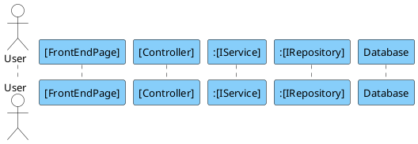

You are an expert software architect. I need the content for a PlantUML file (.puml) that visualizes the execution flow of the [INSERT FUNCTION NAME HERE] feature.

**REFERENCE STYLE & FORMATTING RULES**

1.  **Strict Hierarchical Numbering:** Every message must be numbered based on depth (e.g., 1 -> 1.1 -> 1.1.1 -> 1.1.1.1).
2.  **Participant Order:** Actor -> Frontend Page -> Controller -> Service(s) -> Repository(s) -> Database.
3.  **Naming Convention:** Use Interface names for backend components (e.g., `:IItemService`).
4.  **Visual Style:** Use the skinparams provided below.

**MANDATORY TEXT & SYNTAX PATTERNS**

1.  **Database Interaction:** Label repository-to-database calls as: **"Execute query"**.
2.  **UI Feedback:** Label the final return to user as: **"Display message 'ACTUAL STRING'"**.
3.  **Conditional Syntax (CRITICAL):** \* Use double quotes for the condition text to ensure spaces are handled correctly.
    - **Do NOT manually add square brackets `[]`**. PlantUML adds these automatically for `alt` and `loop`.
    - **Correct Format:** `alt "model.Id != null"`
    - **Correct Format:** `loop "For each item"`

**PARTICIPANTS**

- **Actor:** User
- **Frontend:** Page/Component
- **Controller:** Backend API Controller
- **Service:** Domain Service (prefix with `:`)
- **Repositories:** Repositories (prefix with `:`)
- **Database:** Participant named "Database"

**OUTPUT**
Generate the full content for a file named `SequenceDiagram.puml` inside a code block.

